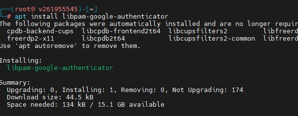
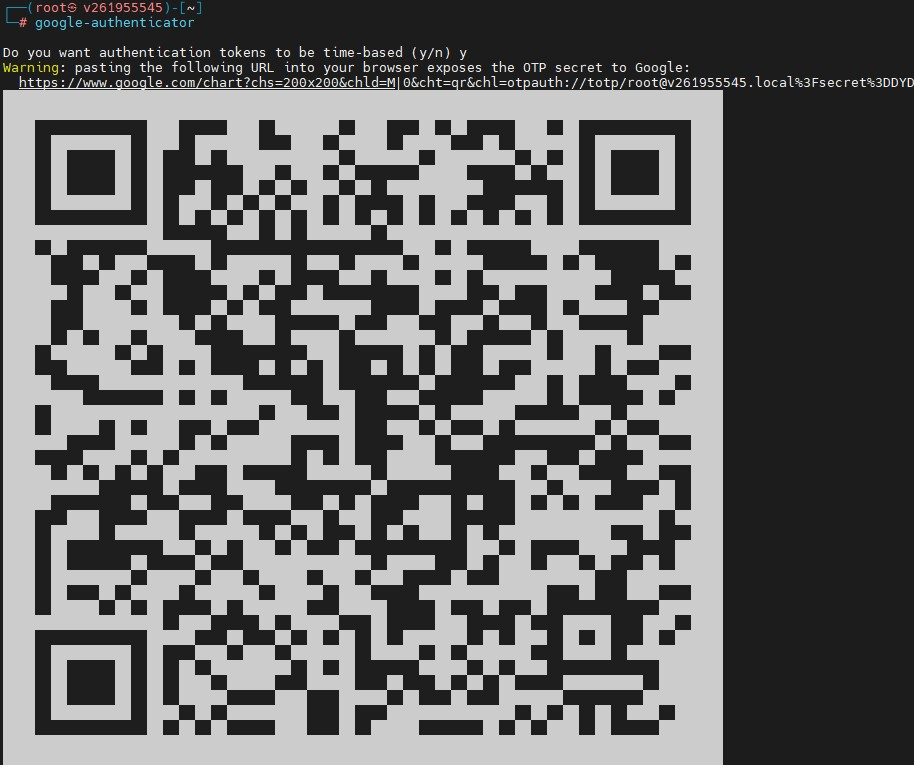
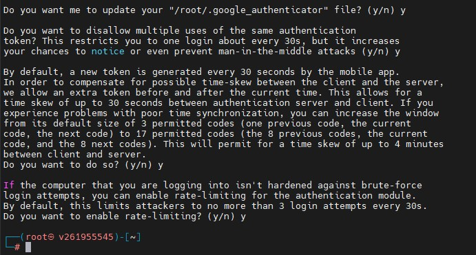
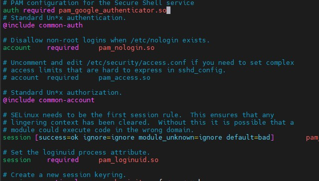
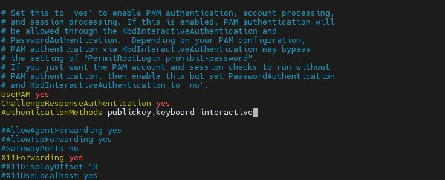
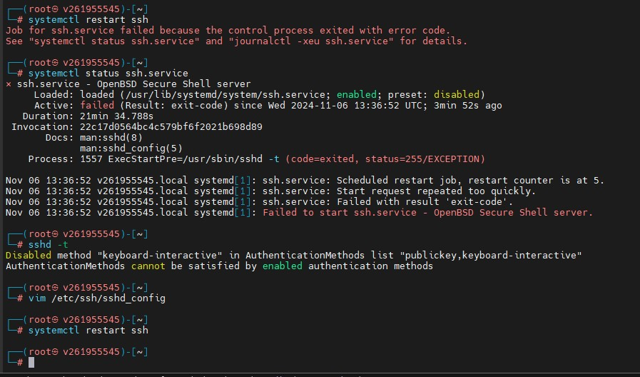
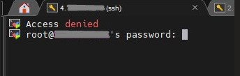

## Домашнее задание № 18   
### Защита инфраструктуры приложений  
#### Часть 2 : honeypot, sandbox, DAC, MFA  

#### 1. Установить 2FA на linux (Google authenticator)  
#### Прислать скрин о запросе кода авторизации  

  
  
  
  
  
  
  

#### 2. any.run  
#### Регистрируемся, тестим ссылки и файлы в sandbox  

