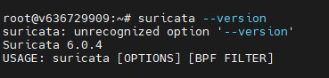
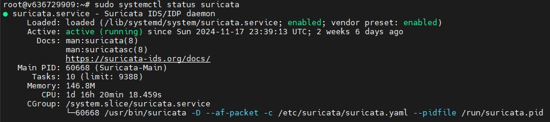
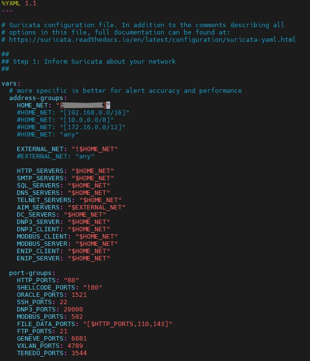
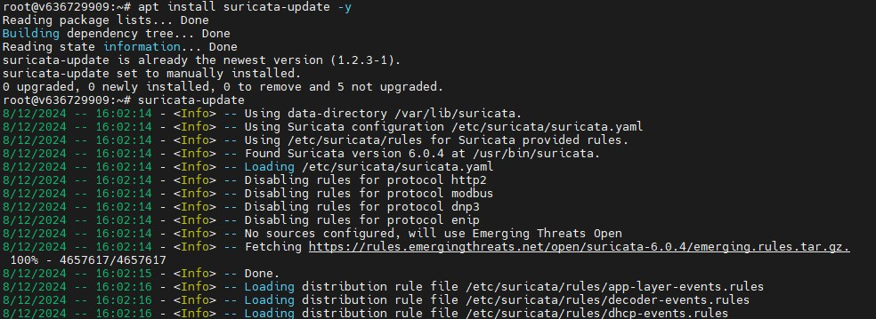
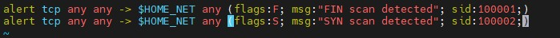
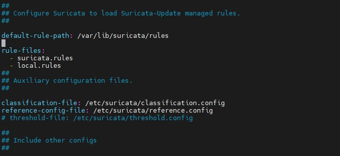
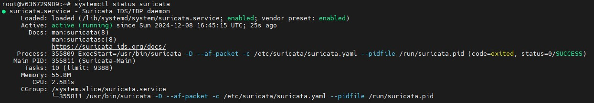
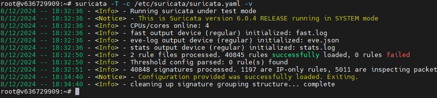
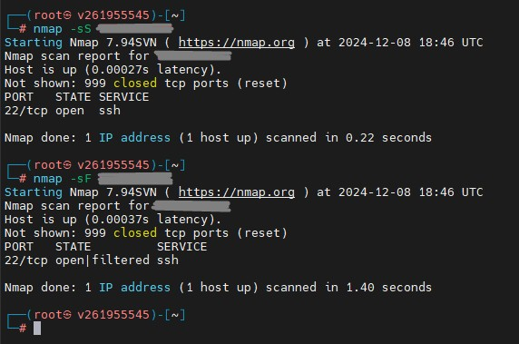
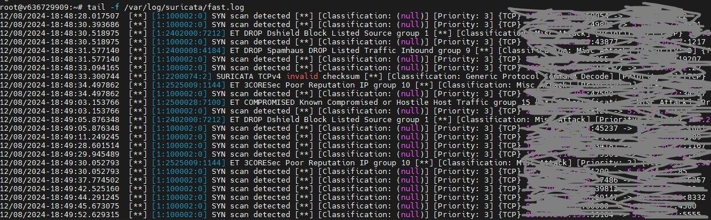

________________________________________
## Домашнее задание № 20  
## Основные виды СЗИ  
## часть 2 :  Dos/DDos, IDS/IPS, Windows Defender  

### Установка и тестирование Suricata IDS  

#### Установить Suricata  
  
#### Добавить правило FIN or SYN сканирования в suricata  
  
  
  
  
  
#### Перезагрузить suricata  
  
  
#### Запустить kali linux и просканировать виртуалку suricata  
  
#### Предоставить скрины и лог файла suricata при сканировании  
  

#### Ссылки на дополнительные ресурсы  
●	Fail to ban - анализ лога и блокировка  
●	Hydra - инструмент подбора паролей, bruteforce  
●	Suricata - сетевая IDS система  
●	Suricata- docs, документация  
●	Windows Defender - что это и как с ним работать  
●	Passwords and Users database  

________________________________________

