# Работа с Cisco Packet Tracer.  

Ниже можно по порядку увидеть скриншоты как я делала, с настройками, пингом, сайтом и в конце пакет.
Оно не идеально, но я старалась. И сам .pkt файл с сетью тоже загрузила.

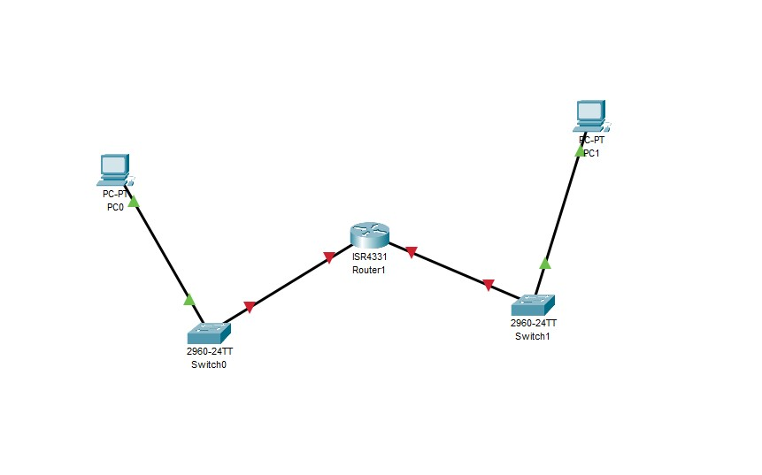
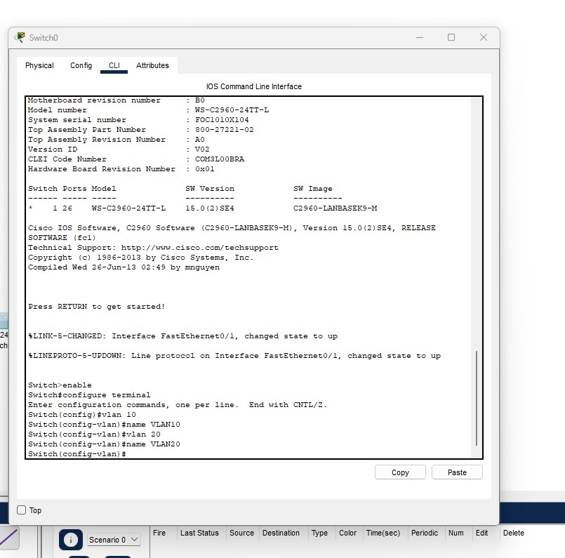
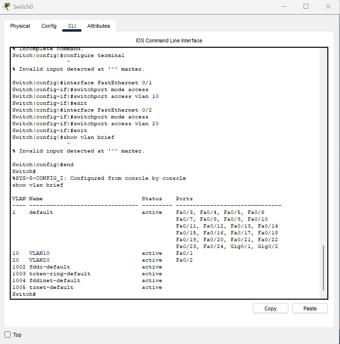
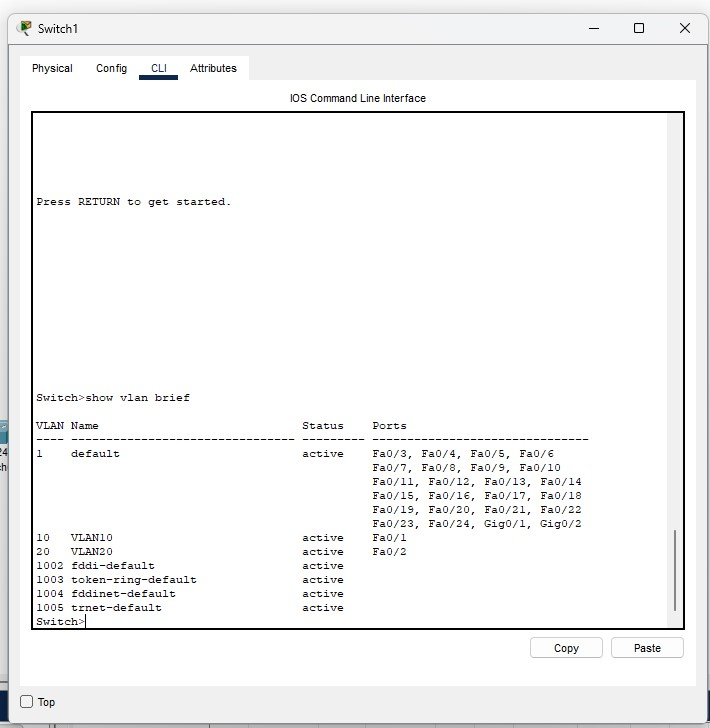
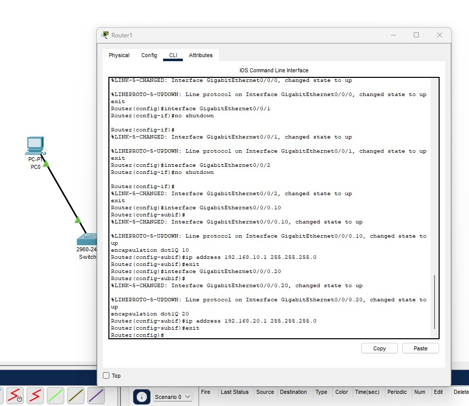
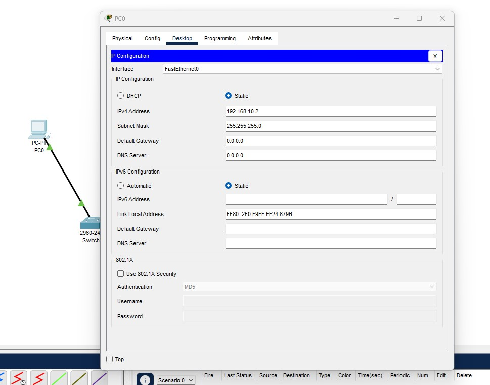
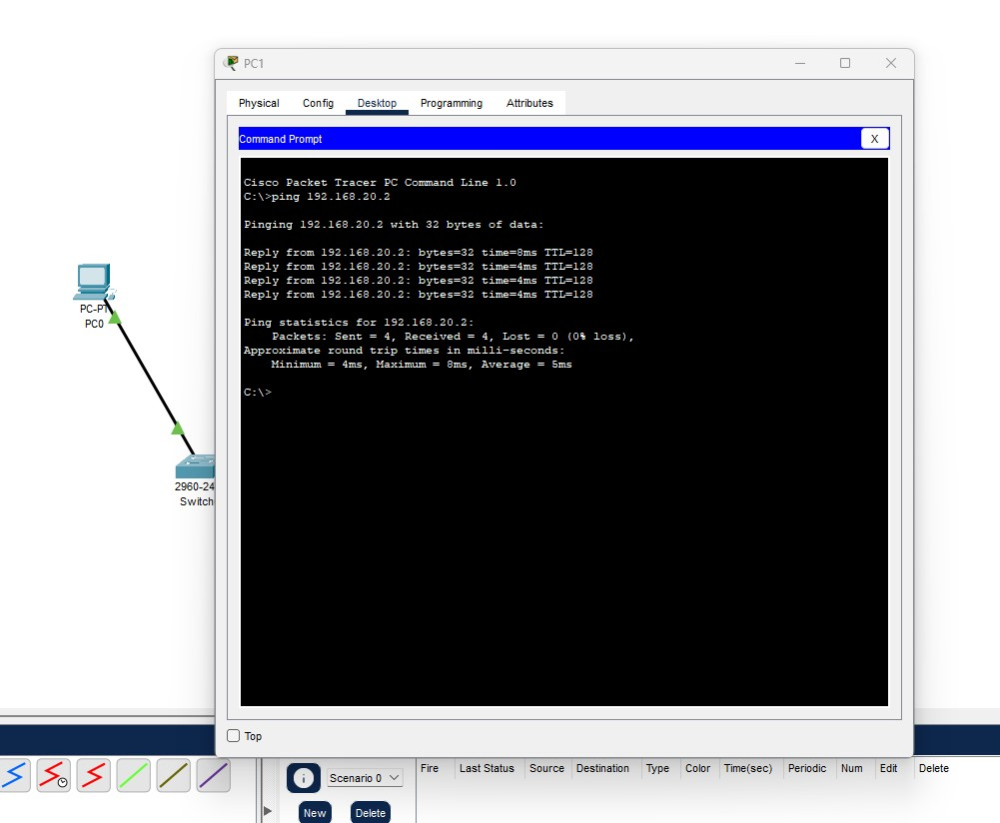
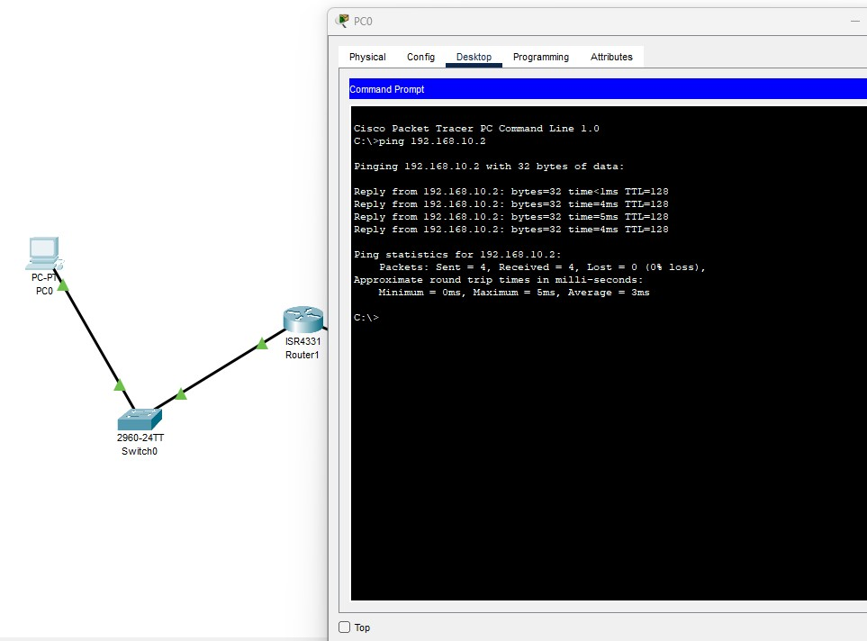
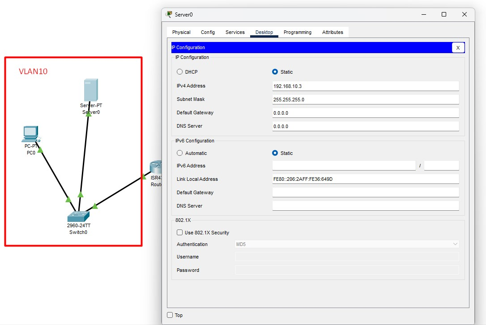
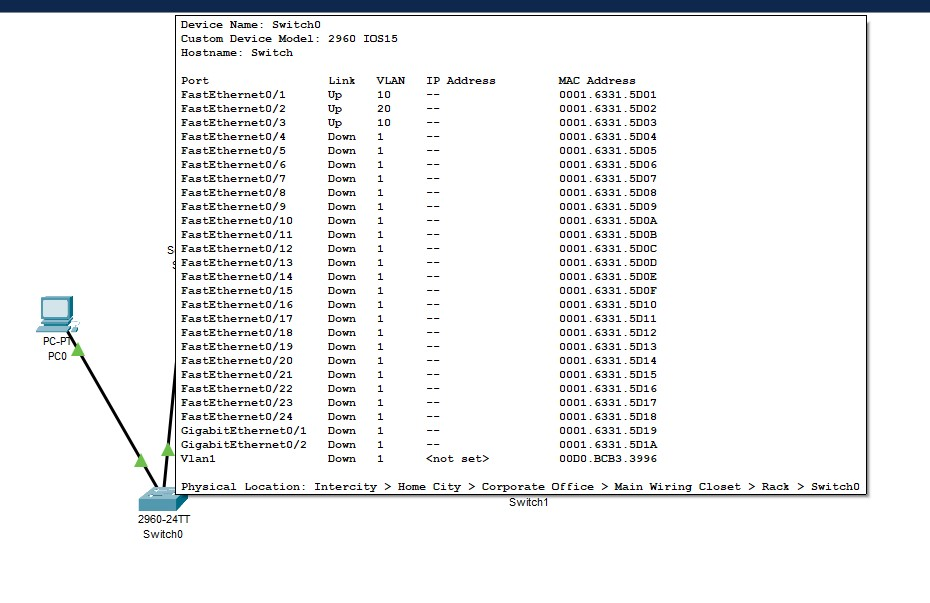
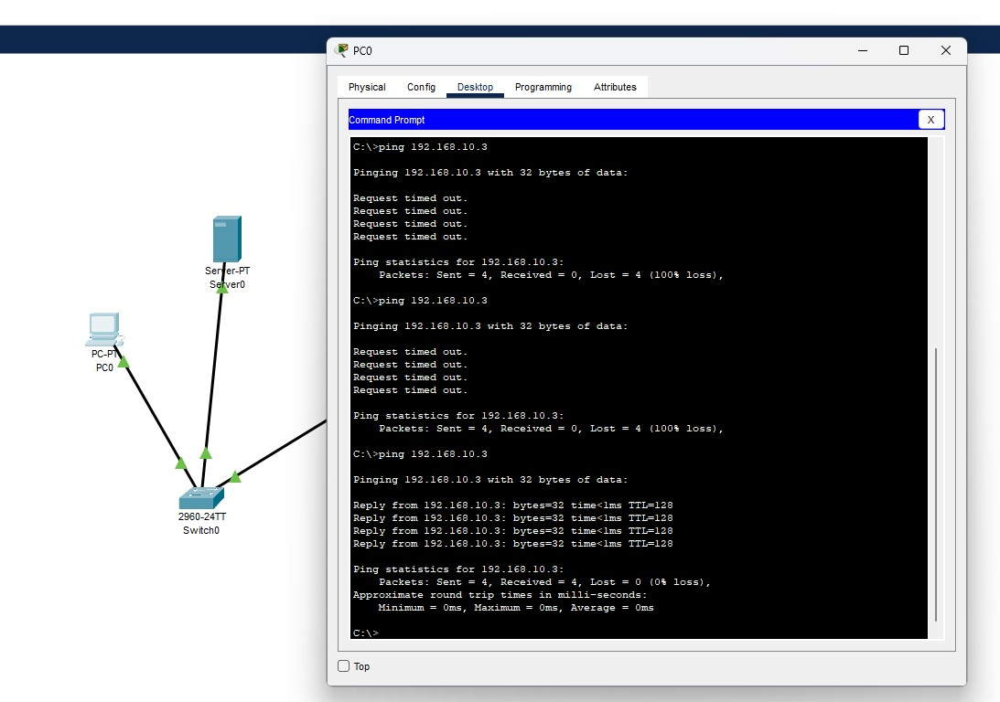
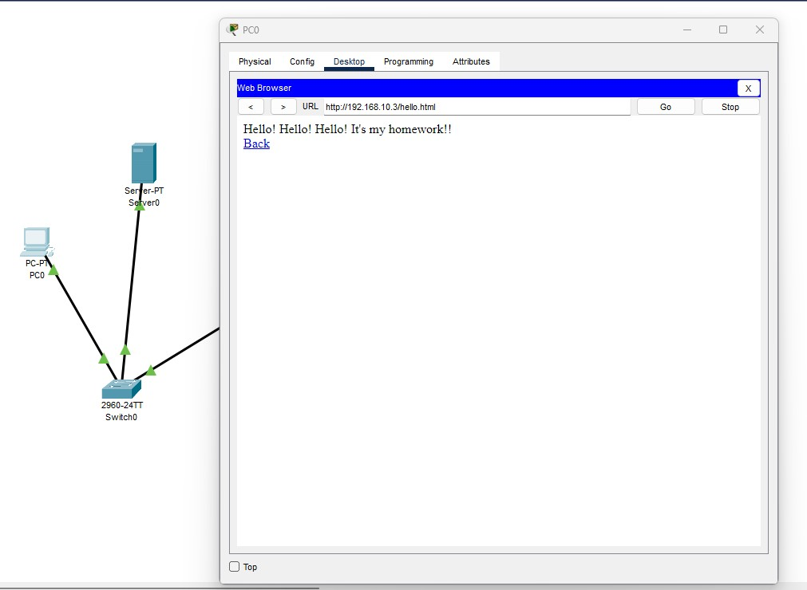
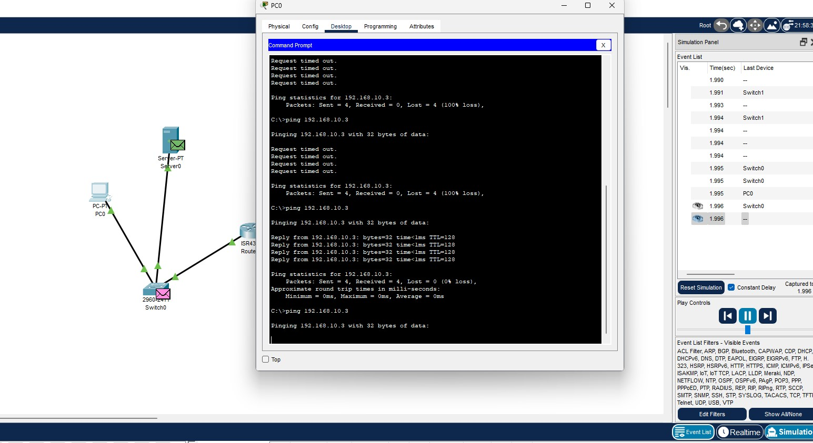
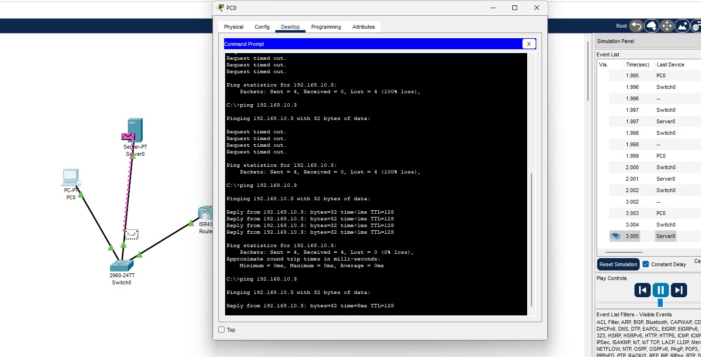

