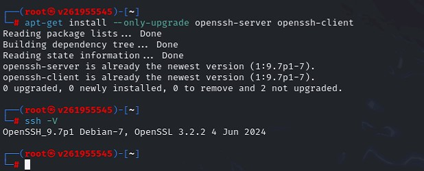
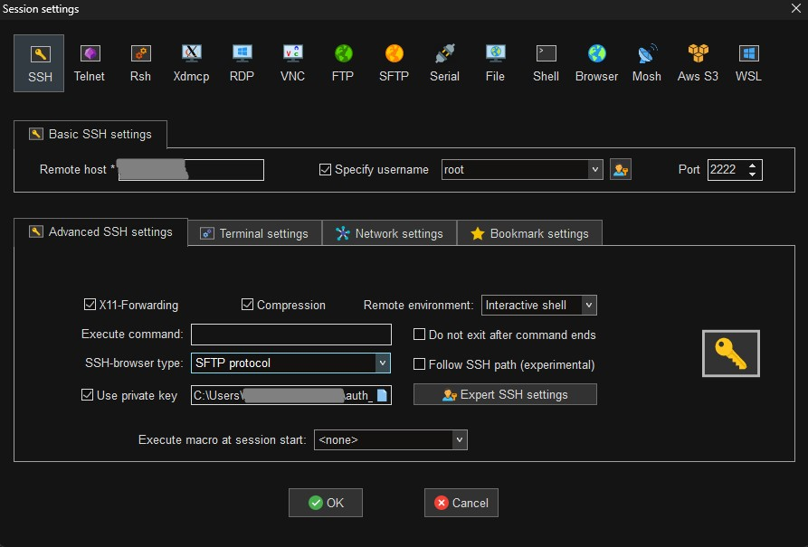
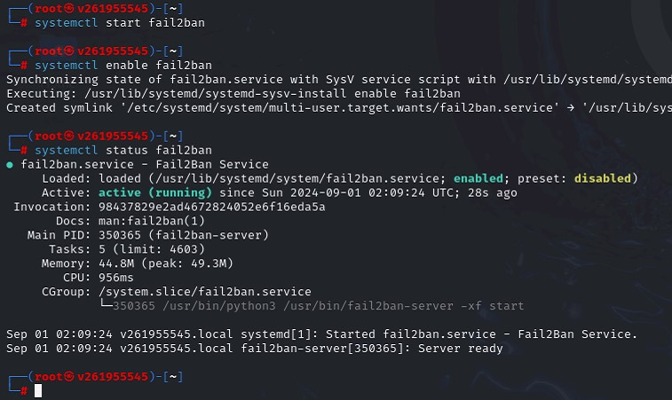

# Homework_6: Криптография

## 1. Изучить и описать этапы, методы и протоколы IPSec фреймворка

### IKE Phase 1

**Цель:** Установление защищенного канала связи между двумя сторонами для дальнейшего обмена ключами.

**Процесс:** 
- Обмен идентификационной информацией и параметрами защиты (алгоритмы шифрования и аутентификации).
- Создание SA (Security Association) для IKE.

**Режимы:** 
- **Main Mode:** Шесть шагов обмена, большая конфиденциальность.
- **Aggressive Mode:** Три шага обмена, менее защищен.

Фаза 1 протокола IKE (Internet Key Exchange) предназначена для установления защищенного канала связи между двумя сторонами, которые будут использовать IPsec.  
Эта фаза включает следующие шаги:
- **Аутентификация сторон**: Участники подтверждают свою личность, используя сертификаты, ключи или пароли.
- **Обмен ключами**: Обмениваются параметрами шифрования и ключами для установления защищенного канала связи.
- **Установление защищенного канала**: Создается защищенный канал, который используется для обмена сообщениями в фазе 2.

### IKE Phase 2
**Цель:** Создание туннеля IPSec для обмена защищенными данными.

**Процесс:**
- Использование защищенного канала, созданного в IKE Phase 1, для генерации ключей шифрования и установления параметров туннеля.

**Режим:** Quick Mode.

Фаза 2 IKE используется для создания и управления защитными ассоциациями (SA), которые определяют параметры шифрования для передачи данных:
- **Создание защищенных ассоциаций**: Определяются параметры шифрования, такие как алгоритмы шифрования и аутентификации, время жизни сессии и другие параметры.
- **Передача данных**: Все данные, передаваемые между участниками, шифруются и аутентифицируются на основе настроек SA, созданных в этой фазе.  

### IPSec framework protocols
- **AH (Authentication Header):** Целостность данных и аутентификация источника, без шифрования данных.
- **ESP (Encapsulating Security Payload):** Шифрование данных, целостность и аутентификация.
- **SA (Security Association):** Набор параметров для создания защищенного соединения.

### HTTP vs HTTPS

#### HTTP
HTTP (Hypertext Transfer Protocol) — это протокол для передачи данных между веб сервером и браузером. Данные передаются в открытом виде, что делает их уязвимыми для Man in the Middle атак.

#### HTTPS
HTTPS (Hypertext Transfer Protocol Secure) — это защищенная версия HTTP, которая использует SSL/TLS для шифрования данных, передаваемых между сервером и браузером. HTTPS обеспечивает конфиденциальность, целостность и аутентификацию передаваемых данных.  

---

## 2. SSH Best Practice
**Задачи:**
- Настроить SSH на Kali по лучшим практикам.
- Сгенерировать ключи на Windows хост, добавить публичный ключ на Kali, и подключиться с использованием приватного ключа.

## Что входит в лучшие практики?
- Обновление OpenSSH. Чтобы не допускать применения уязвимостей, нужно регулярно обновлять его до актуальной версии.
- Создание пары ключей, публичный .pub отправить на сервер, приватный .ppk сохранить у себя.
- Настройка sshd_config : меняем порт со стандартного 22 (строка Port). Отключение авторизации по паролю, разрешаем только по ключу. PasswordAuthentication no и PubkeyAuthentication yes. После изменения конфига нужно перезапустить, systemctl restart ssh.
- Запретить доступ с пустыми паролями PermitEmptyPasswords no.
- Поставить Fail2Ban чтобы блокировать IP после неудачных попыток входа.

## 3. WireGuard VPN
Немного изменила задание, попробую создать VPN между Win хост и Kali.  
**Задачи:**
- Настроить RDP и SSH на Kali.
- Установить и настроить WireGuard VPN на Kali и хостовой машине.
- Настроить VPN соединение между Kali и хостовой машиной.
