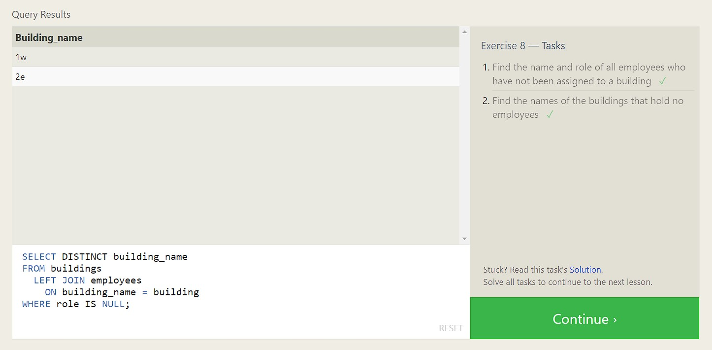

# Домашнее задание 7
### Темы: Типы атак I, OWASP top 10, CVE, CWE, CAPEC, Injection, SQL

## 1. SQL
 На тренажере SQLBolt я прошла 8 уровней. Cкриншот прогресса:  

## 2. Лабораторные работы по OWASP TOP 10

### 2.1 Лабораторные работы по Broken Access Control
- **Lab Broken Access Control 1:**
  * Описание лабораторной работы.
  * Скриншоты и выводы.
  
- **Lab Broken Access Control 2:**
  * Описание лабораторной работы.
  * Скриншоты и выводы.

### 2.2 Лабораторная работа по Injection
- **Lab Injection 1:**
  * Описание лабораторной работы.
  * Скриншоты и выводы.

### 2.3 Лабораторная работа по Server-Side Request Forgery (SSRF)
- **Lab SSRF 1:**
  * Описание лабораторной работы.
  * Скриншоты и выводы.

## 3. Тренировка поиска уязвимостей на примере OWASP Juice Shop
- Описание работы с **OWASP Juice Shop**.
- Найденные уязвимости и их описание.
- Скриншоты и выводы.
