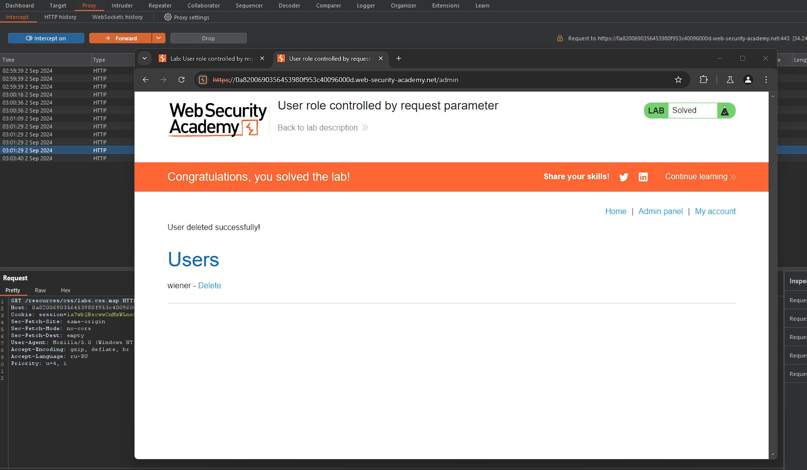
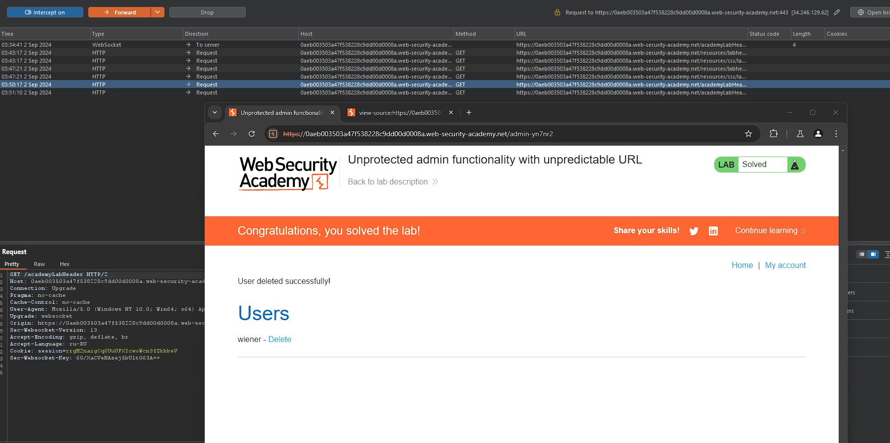
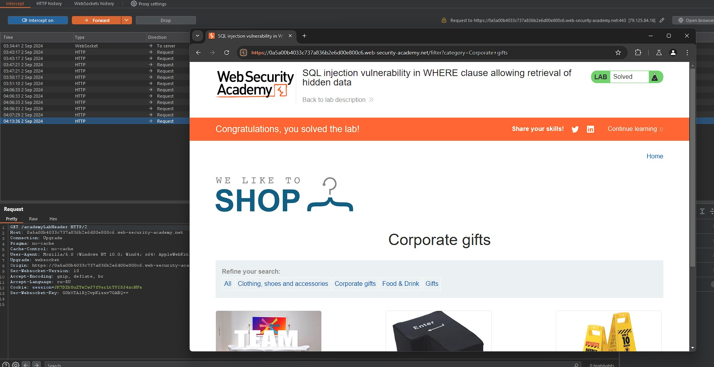
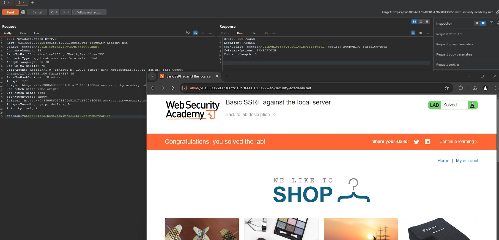

# Домашнее задание 7

## 1. SQL
 На тренажере SQLBolt я прошла 8 уровней. Cкриншот прогресса:  

## 2. Лабораторные работы по OWASP TOP 10

### 2.1 Лабораторные работы по Broken Access Control
- **Lab Broken Access Control 1:**
  
  
- **Lab Broken Access Control 2:**

### 2.2 Лабораторная работа по Injection
- **Lab Injection 1:**
  

### 2.3 Лабораторная работа по Server-Side Request Forgery (SSRF)
- **Lab SSRF 1:**

  
## 3. Тренировка поиска уязвимостей на примере OWASP Juice Shop
- (пока не сделано!!!)
