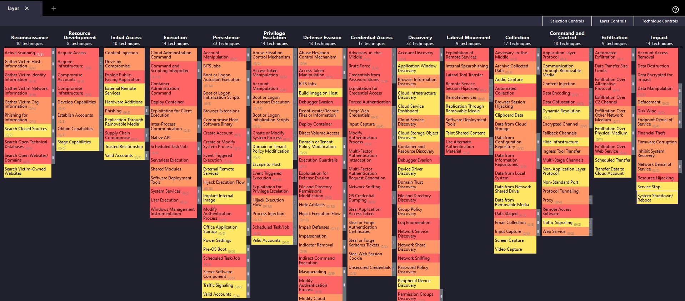

# Домашнее задание 10-11  
### Mittre At&ck / Re&ct / D3fence  
### Вы – хакер находящийся в интернете, вам необходимо проникнуть внутрь инфраструктуры и скомпрометировать 2 цели.    
1) Компьютер глав буха компании  
2) Ноутбук системного администратора. Применяя матрицу Att&ck.  
### Разработать план защиты и план реагирования на атаку, которую вы провели гипотетически в предыдущем задании. Используя матрицы D3fence и Re&ct  
p.s. У вас есть базы данных, AD DC, Cisco ASA, FTP / NFC servers, Wi-Fi routers, Web server ISS/ Nginx, внешние и внутренние ресурсы  

### Первый сценарий атаки: компьютер главного бухгалтера. Идем таким путем:  

#### Initial Access [TA0001]  
Spear Phishing Attachment [T1566.001]: Отправка фишингового письма с вредоносным вложением главному бухгалтеру.  

#### Execution [TA0002]  
PowerShell [T1059.001]: Использование PowerShell для выполнения вредоносного скрипта, полученного из вложения.  

#### Persistence [TA0003]  
Account Manipulation [T1098]: Изменение свойств учетной записи главного бухгалтера для обеспечения постоянного доступа.  

#### Credential Access [TA0006]  
Credential Dumping [T1003]: Использование ПО, например Mimikatz для извлечения учетных данных.  

#### Exfiltration [TA0010]  
Exfiltration Over Command and Control Channel [T1041]: Передача полученных данных через управляющий канал на наш управляющий сервер  

### Второй сценарий: ноутбук системного администратора. Идем таким путем:   

#### Initial Access [TA0001]  
Exploit Public-Facing Application [T1190]: Эксплуатация уязвимостей веб приложения, доступного через интернет.  

#### Lateral Movement [TA0008]  
Remote Services [T1021]: Доступ к внутренним системам через удаленные сервисы, используя полученные ранее учетные данные.  

#### Collection [TA0009]  
Data from Local System [T1005]: Сбор данных с локальной системы.  

#### Impact [TA0040]  
Data Destruction [T1485]: Удаление или повреждение критических данных для максимизации ущерба.  

### Теперь с помощью Mittre Attack Navigator проектирую картину общей модели возможных атак. Получилось как-то так)    
  

### Сценарий защиты инфраструктуры от атак из первой задачи по матрицам D3fence и React:  

### D3fence  

#### Secure Configuration [D3F0010]  
Защита публичных приложений: Регулярное обновление и патчинг веб серверов и приложений, установка Web Application Firewall (WAF).  

#### User Training [D3F0011]  
Обучение по безопасности: Регулярные тренинги для сотрудников о фишинге и социальной инженерии, учебные симуляции фишинговых атак.  

#### Identity and Access Management [D3F0004]  
Многофакторная аутентификация (MFA): Внедрение MFA для всех пользователей, особенно для административных аккаунтов.  
Минимальные привилегии: Ограничение прав доступа сотрудников в соответствии с их ролями и обязанностями.  

#### Endpoint Security [D3F0006]  
Антивирусное ПО и EDR: Установка и настройка антивирусных решений и Endpoint Detection and Response (EDR) на всех рабочих станциях и серверах.  

Network Segmentation and Monitoring [D3F0002]  
Сегментация сети: Изоляция критически важных активов, включая серверы и устройства хранения данных.  
Мониторинг сети: Использование инструментов IDS/IPS для обнаружения и блокировки подозрительных действий в сети.  

### Реагирование на инциденты (React)  

#### Incident Response Planning [REACT0001]  
План реагирования на инциденты: Разработка и регулярное обновление плана реагирования, включающего процедуры уведомления, эскалации и восстановления.  

#### Communication [REACT0003]  
Коммуникации во время инцидента: Установка четких каналов связи между командой безопасности, разработчиками/девопсами и руководством.  

#### Analysis and Forensics [REACT0004]  
Анализ и форензика: Применение инструментов форензики для исследования и документирования инцидентов.  

#### Containment and Mitigation [REACT0005]  
Локализация и смягчение последствий: Быстрая локализация инфицированных систем, прекращение злоупотреблений и внедрение необходимых патчей или обновлений.  

#### Recovery [REACT0006]  
Восстановление систем: Восстановление из резервных копий, проверка на чистоту систем и возвращение в нормальное рабочее состояние.  

