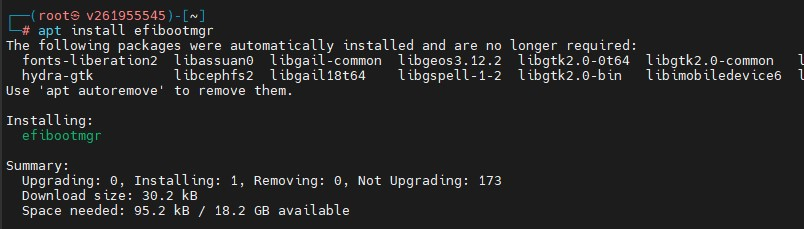
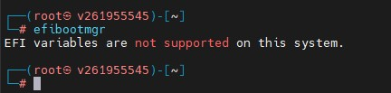
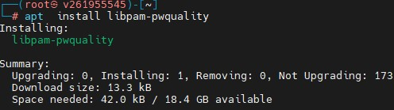
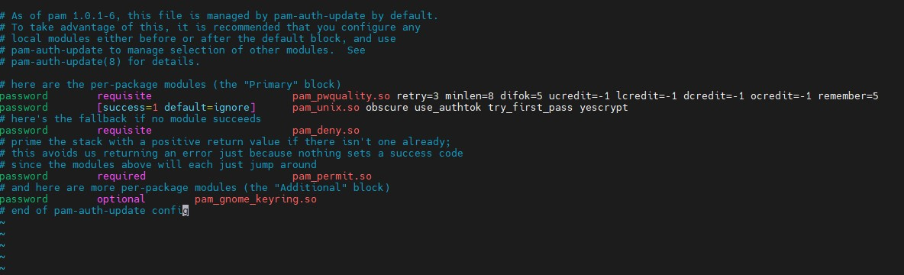
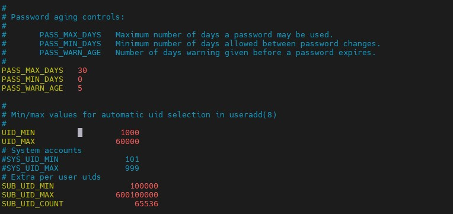
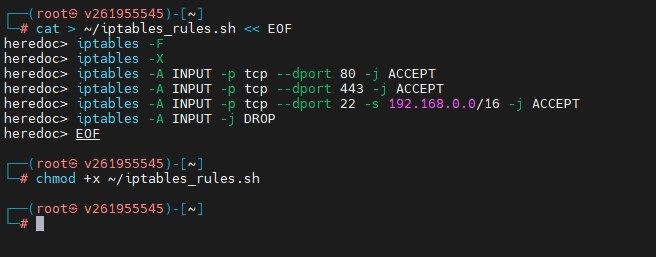
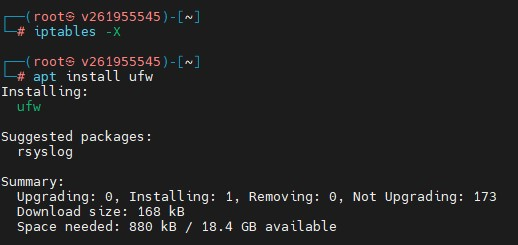
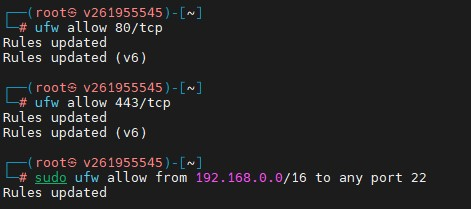
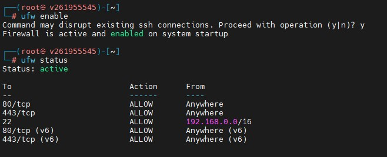

## Безопасность Linux OS  
*NIX системы, SELinux vs Apparmor vs DAC, iptables, ufw  

### Нужно настроить виртуальную машину Ubuntu (выполняла на Kali)  

1. Настроить BIOS/UEFI + парольную политику (слайд 26-30)  
У меня удаленная Кали и нет доступа к гипервизору, поэтому попыталась настроить через efibootmgr, но не прокатило)  

И перешла к парольной политике:  
Настройка сложности паролей  
   
  
И настройка срока жизни паролей   
  
 
2. Настроить iptables правила в виде файла скрипта *.sh (скрипт приложить в папку с ДЗ):    
- Разрешить все соединения по 80, 443 порту  
- Разрешить подключение к 22 порту только из внутренней сети  
- Натировать (nat) весь трафик через интерфейс VM  

И вот мой скрипт, создавала не в редакторе а сразу в консоли через cat и EOF:  
  
 
3. Очистить все правила iptables, установить UFW firewall
  

 
 
