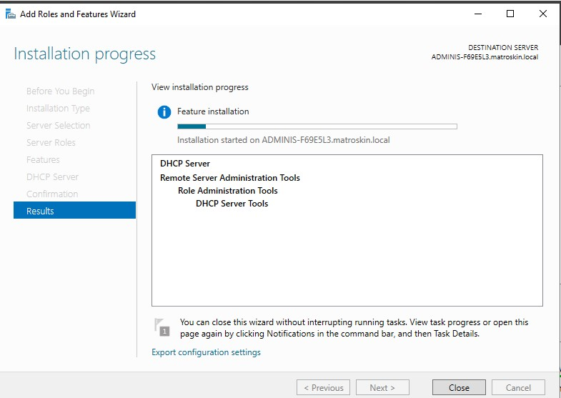

## Домашнее задание № 15-16  
### Защита инфраструктуры предприятия  
win server roles, linux services, firewalls, zero trust, proxy  

### 1) Поднять контроллер домена DC1 в отдельной подсети  
#### Установить роль DHCP сервера в AD, с раздачей настроек IP и DNS  
#### Поднять VM Win10 в данной подсети, проверить получение сетевых настроек данной VM по DHCP  
#### Добавить данную VM в домен < фамилия>.tms (local)    

Здесь не все сделано, т.к. удаленные машины и между ними реальный домен делать с реальными ip не получилось   

   
   
   
   

### Настроить AD GPO согласно лучших практик   
#### Создать контейнер - организационный юнит OU, в ней 2 контейнера OU fin and hr и по 2 пользователя в каждом контейнере   
#### для OU fin создать и прикрепить fin_gpo и настроить парольную политику сложности пароля 10 символов, 5 паролей не должно совпадать, срок действия пароля 90 дней   
#### для OU hr создать и прикрепить hr_gpo и настроить парольную политику сложности пароля 8 символов, 180 дней срок действия, блокировка экрана 15 мин после бездействия   
#### Зайти под одним из созданных пользователей на VM Win10, вывести в Powershell примененные групповые политики командой gpresult /r  

Тут тоже без последнего пункта, но все остальное прописала  
  
  
  
  
  
  
  

