## Домашнее задание № 17  
### Защита инфраструктуры приложений  
#### virtualization, cloud, containers  

### 1. Исследуем docker  
#### ●	Скачать образ ubuntu:18.04 c hub.docker.io, проверить целостность и соответствие контрольной суммы образа SHA256  
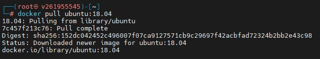  
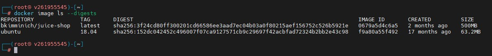  
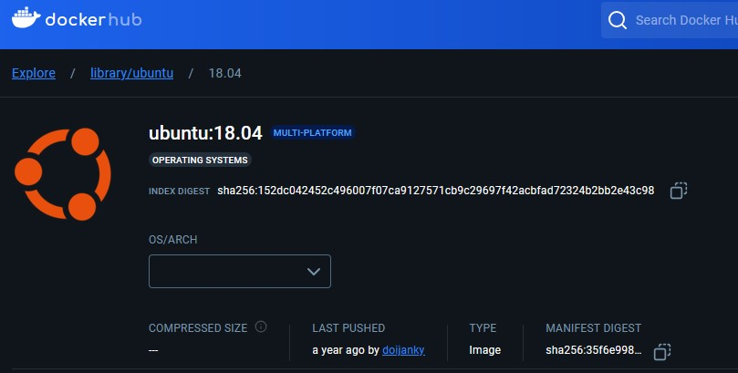  
#### ●	С помощью команды docker image ls отобразить все docker образы на системе, добавить в группу docker вашего пользователя для запуска команд docker без sudo  
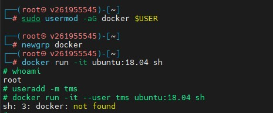   
#### ●	Запустить данный образ в интерактивном режиме в оболочке sh docker run -it <image name> sh  
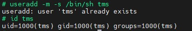   
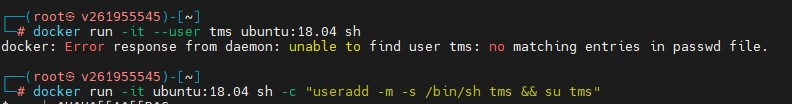   
#### ●	Внутри контейнера выполнить команду whoami для определения пользователя под которым вы запустили контейнер  
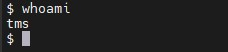   
#### ●	Запустить контейнер под пользователем tms  
#### ●	Прогнать образ через один из сканеров безопасности проанализировать результаты:  
#### ●	https://github.com/quay/clair  
#### ●	https://github.com/aquasecurity/trivy  
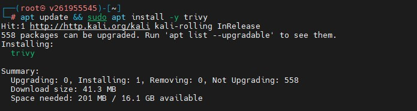   
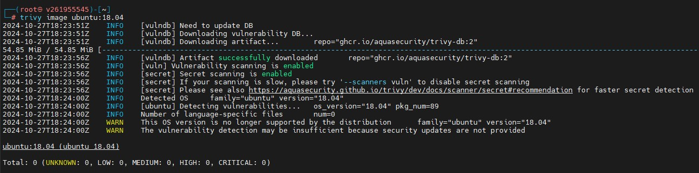   

### *2. Пишем Dockerfile    
#### ●	Скачать и видоизменить файл конфигурации nginx.conf, файл должен выводить “Welcome to the TMS Cybersecurity Course”    
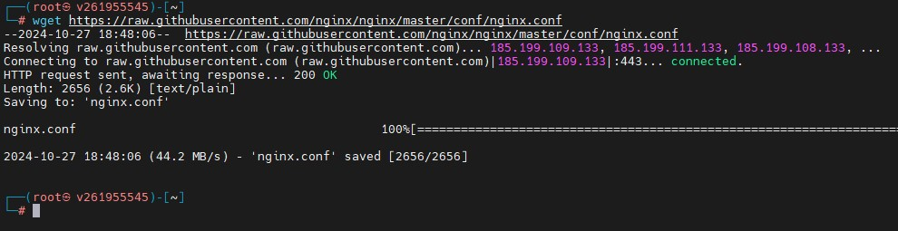   
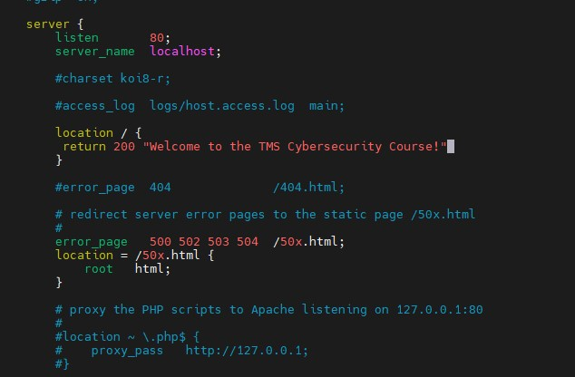   
#### ●	Создать Dockerfile c базовым образом ubuntu:20.04, в котором вы устанавливаете Nginx веб сервер, а затем копируете заранее скачанный файл конфигурации nginx.conf во внутрь директории nginx контейнера    
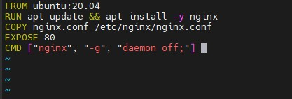   
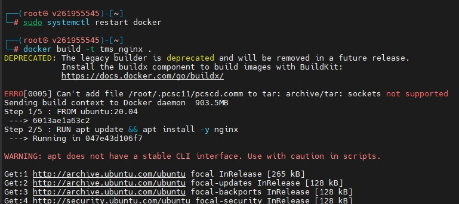     
#### ●	Запускаем контейнер перебрасывая 8800 порт хоста на 80 порт контейнера    
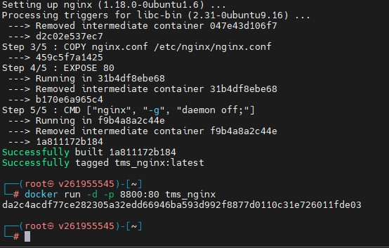     
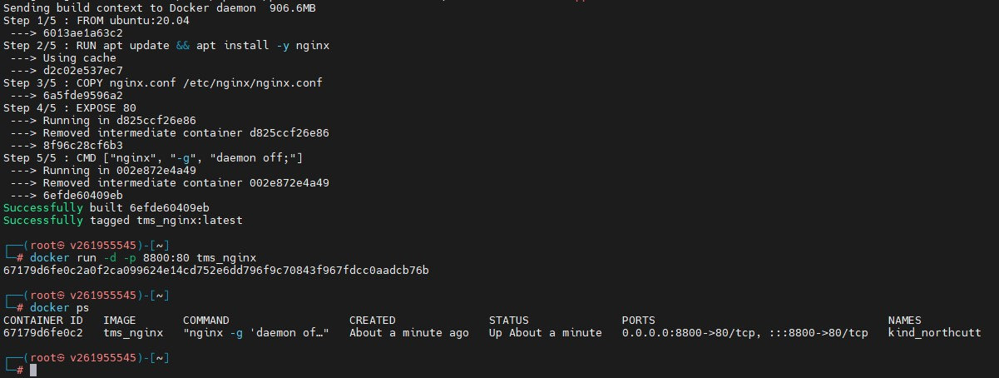   
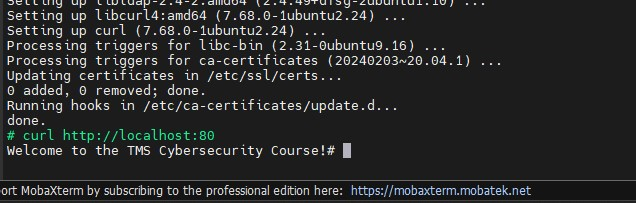   
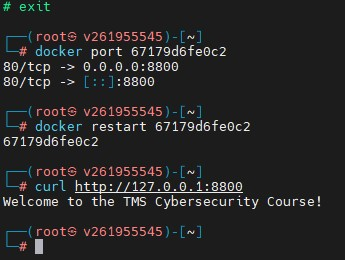   
#### ●	Вывод 127.0.0.1:8800 в браузере скриним      
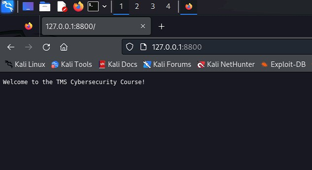   