### Домашнее задание № 19   
#### Основные виды СЗИ  
#### часть 1 : AV, NGFW, PAM, DLP, XDR, EDR, MDR   

### 1. Установить антивирус ClamAV  
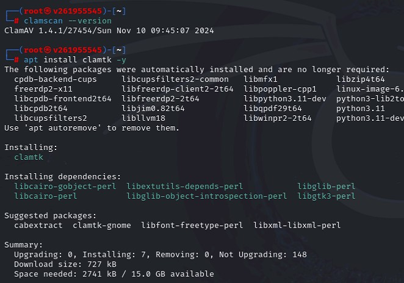  
#### ●	Также установить графическую оболочку  
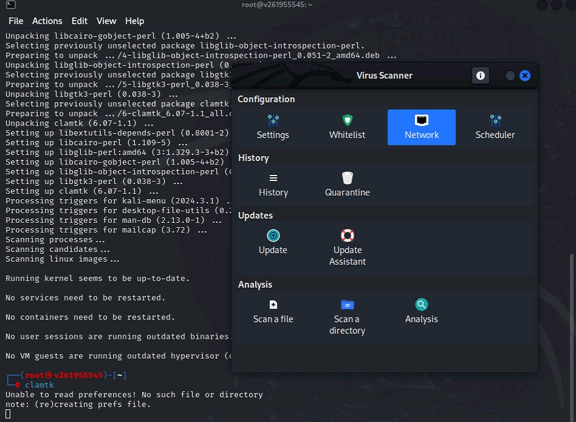  
#### ●	Просканировать любую директорию  
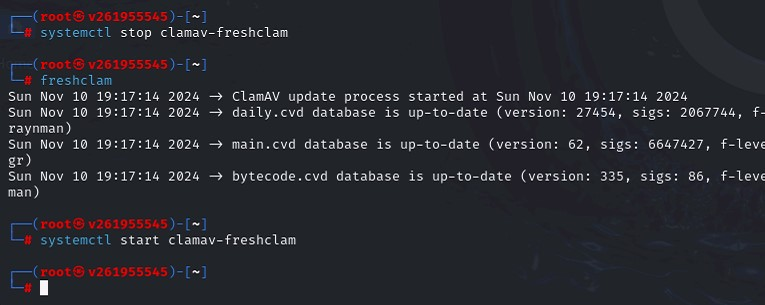  
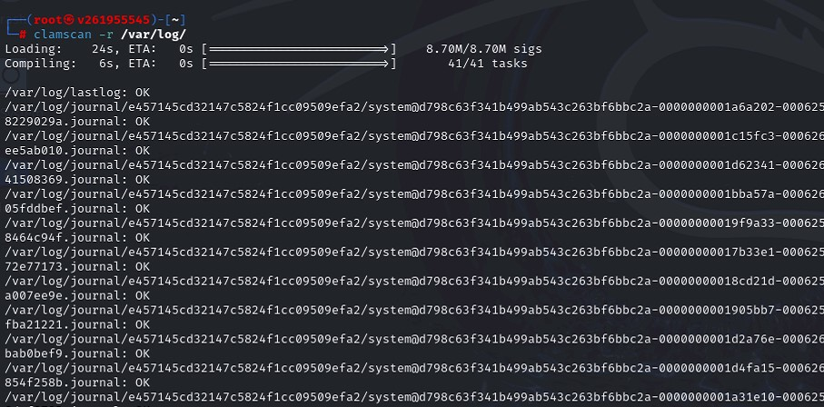  

### 2. Установить YARA  
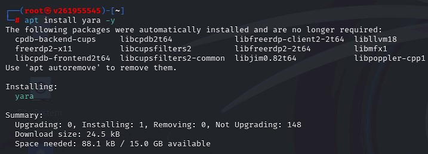  
#### ●	Создать текстовый файл и вычислить его hash   
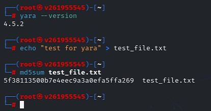  
#### ●	Написать правило для детектирования данного файла    
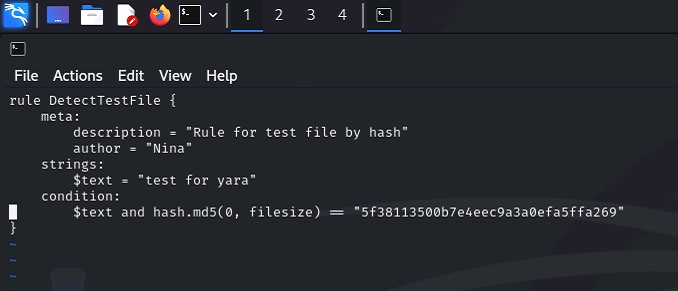  
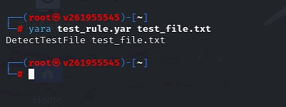  

### *3. Установить WAF (nginx + Modsecurity)   
#### ●	установить и протестировать запрет тестового запроса    
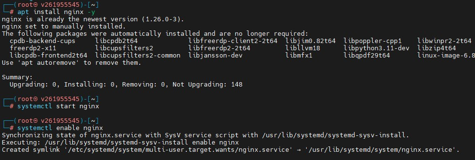  
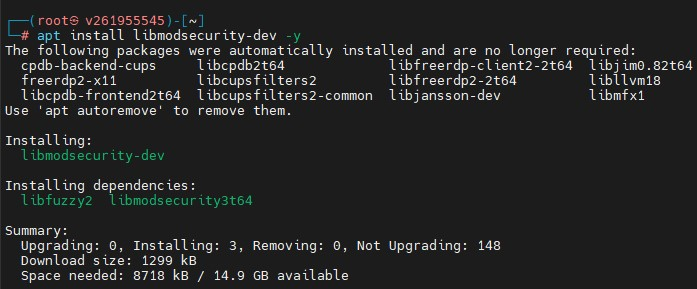  
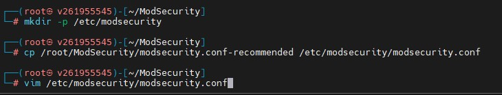  
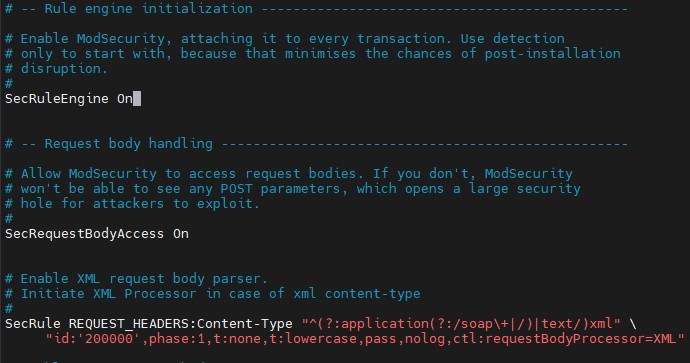  
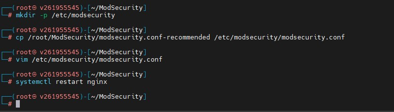  
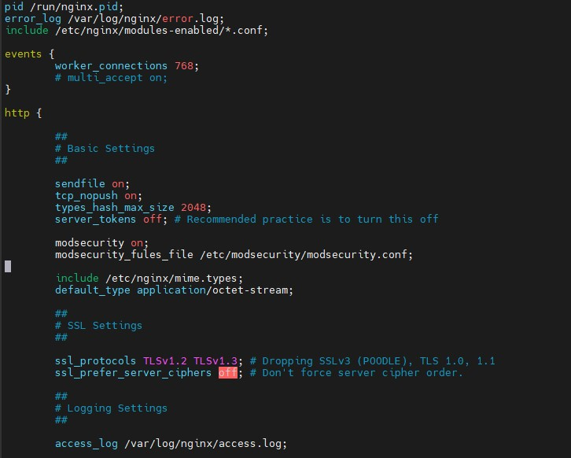  

#### Ссылки на дополнительные ресурсы  
●	Настройка Jump Server - Bastion  
●	MDR архитектура от Kaspersky  
●	YARA installation and docs  
●	YARA команды проверки  
●	Nginx + Modsecurity WAF  
●	Smirnov nginx + modsecurity github   
●	NGFW  free course   
