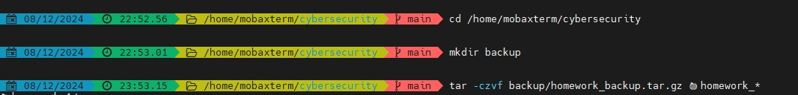
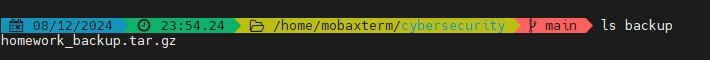
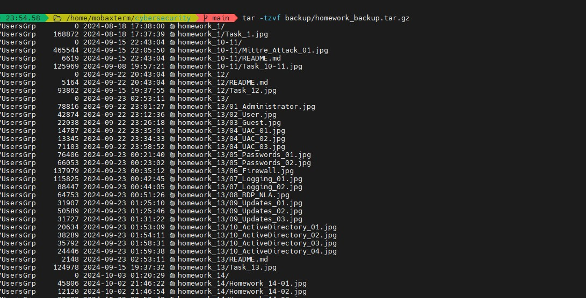

# Домашнее задание №21  
## Аудит, тестирование и backup  

### Выполненные шаги:  
1. Проведена ревизия предыдущих домашних работ.  -- все сделаны и отмечены яблочком 🍏    
2. Созданы резервные копии файлов и результатов.  -- сделан и проверен бэкап выполненных домашек  
  
  
  

3. Ознакомление с документацией:  
   - [NIST Standards](https://www.nist.gov/document-standards)  
   - [OWASP Top Ten](https://owasp.org/www-project-top-ten/)  
   - [CIS Benchmarks](https://www.cisecurity.org/cis-benchmarks/)  
   - [PCI DSS](https://www.pcisecuritystandards.org/)  

### Резервные копии:  
Бэкап всех выполненных домашек сделан и сохранен в `backup/homework_backup.tar.gz`  

#### Команда для создания бэкапа:
```bash
tar -czvf backup/homework_backup.tar.gz 🍏homework_*
