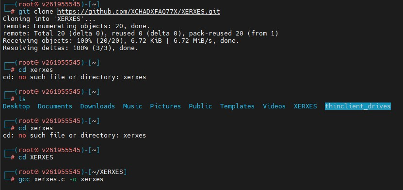
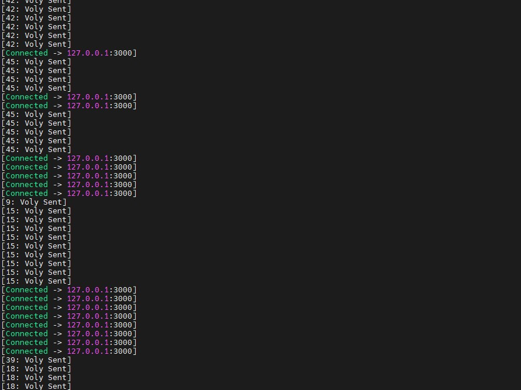
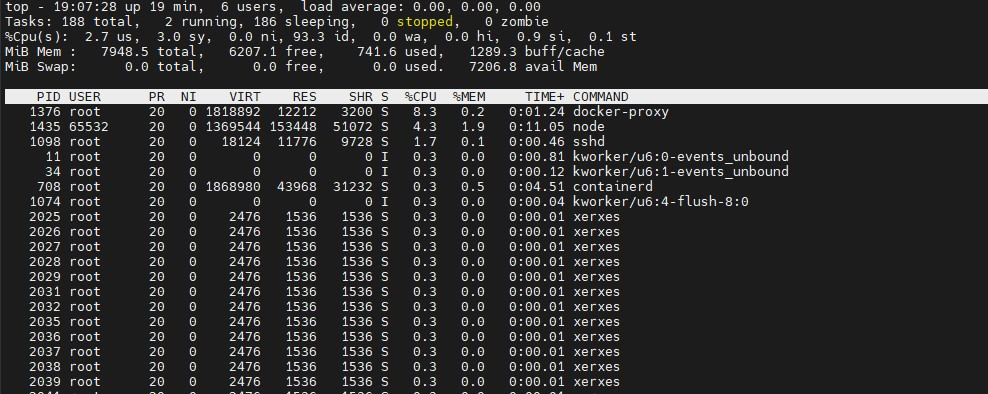
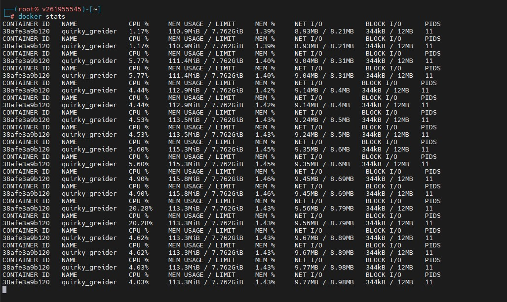

# Homework 8 - DoS атака на Juice Shop    

## Запустить container juice shop и произвести dos    
## XerXes - Most powerful dos tool bY mR.Thg    
## Сделать скрин нагрузки на docker container     

## **Установка XerXes**  

## **Сама DoS атака на Juice Shop**

## **Top - нагрузка на процессор выросла**

## **И еще Docker Stats, тут тоже видно как выросла нагрузка**

