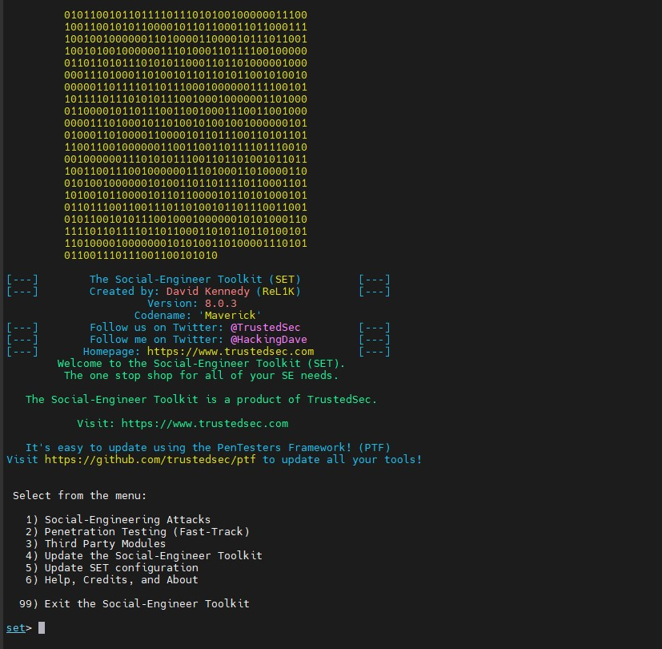
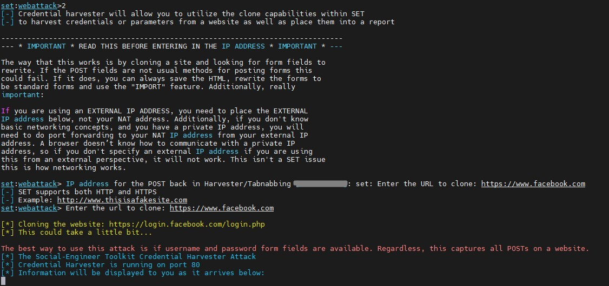
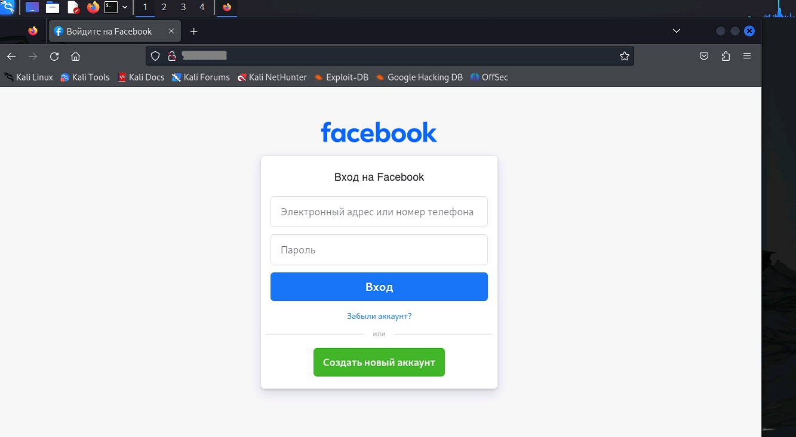
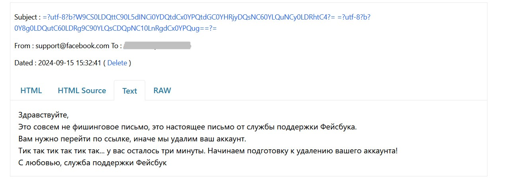

## Домашнее задание № 9  
### Социальная инженерия, фишинг  
Spam, Fishing, Social Engineering  

### Нужно разослать фишинговое письмо с уникальной информацией, ведущее на копию крупного ресурса (соцсети, почты и т.д.)

●	Установить setoolkit на Ubuntu VM  
●	Сделать фишинговое письмо с копией распространенного сервиса  
●	Сделать скрины сервиса и перехвата данных авторизации  
●	*Сделать все это на виртуальной машине в облаке, с привязкой к реальному “поддельному” домену  

Выбрала создать копию логина facebook.com и письмо с адреса support@facebook.com  

